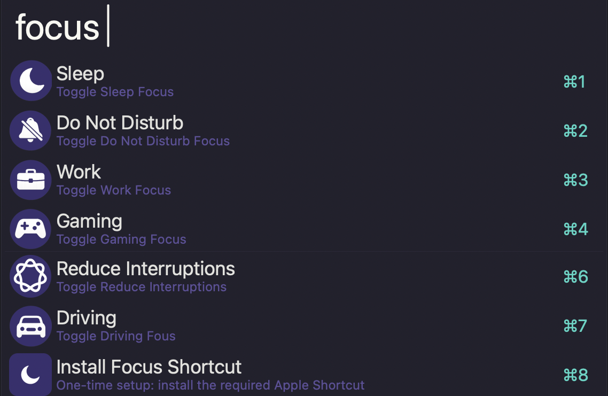

# Focus Toggle

## Setup

This workflow uses a single Apple Shortcut named **Toggle Focus**.

1. Install the Alfred workflow.
2. Type `focus` in Alfred.
3. If the Shortcut isn’t installed yet, you’ll get a dialog prompt with an **Install Shortcut** button (one-time setup).

That’s it.

## Usage

Toggle macOS Focus modes via the `focus` keyword.

* <kbd>↩︎</kbd> Toggle the selected Focus mode on or off.

The workflow automatically reads your Focus modes directly from macOS, so it works in any OS language and includes any custom modes you've created — no manual configuration needed.

Configure the keyword in the Workflow's Configuration.

## Known Limitations

macOS briefly shows a Shortcuts indicator in the menu bar each time a Focus mode is toggled. This is an Apple system behavior and cannot be suppressed.
